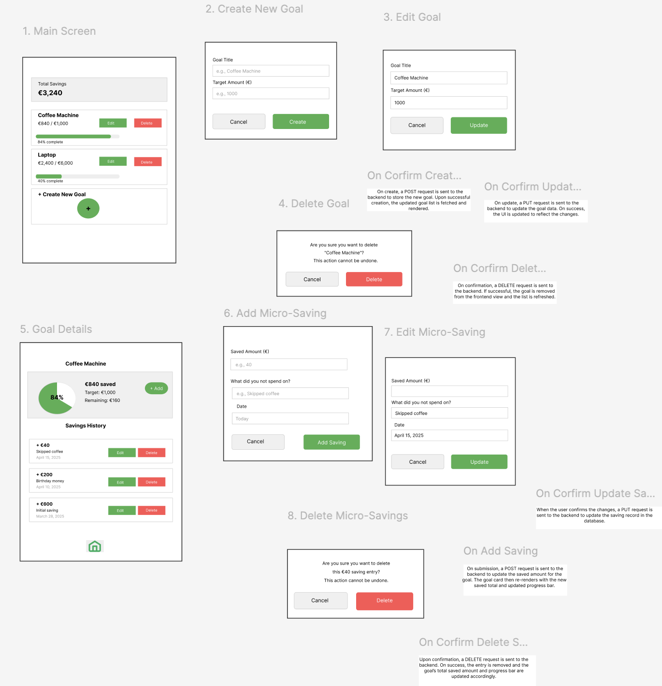

# SkipSave – Savings Tracker

---

## Project Overview

**SkipSave** is a modern personal finance application designed to help users develop mindful spending habits by tracking “micro-savings” toward specific financial goals.  
The main idea is to encourage users to “skip” small daily expenses and save the equivalent amounts toward meaningful objectives.

---

## Key Features

- **View Savings Goals:** See all active goals, including target and saved amounts.
- **Create New Goal:** Add a new savings goal with a title and target amount.
- **Edit or Delete Goals:** Update or remove goals as priorities change.
- **Add Micro-Savings:** Record small savings (e.g., skipping a coffee) and assign them to a goal.
- **View Savings History:** Track all micro-savings entries for each goal.
- **Edit or Delete Micro-Savings:** Update or remove individual savings entries.
- **Visual Progress Tracking:** See progress toward each goal with intuitive progress bars.

---
## UI Wireframe

Below is the main wireframe for SkipSave:

You can explore the interactive prototype here:  
[View on Figma](https://www.figma.com/design/akqK2kJkdFBuz3EsUkq3Hw/SkipSave?node-id=0-1&p=f&t=zIDP7vOFWEpZe9Jh-0)

---

## Tech Stack

- **Backend:** Java , Spring Boot, Spring Data JPA
- **Database:** PostgreSQL
- **Build Tool:** Maven
- **ORM:** JPA/Hibernate
- **Other:** Lombok

